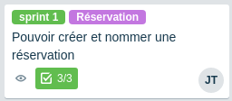

# Organiser un projet en mode scrum avec trello

Le but de cette page est de proposer quelques (bonnes) pratiques que l'on peut utiliser avec trello pour organiser son projet en mode scrum.

Trello est un outil très simple et flexible, d'autres choix de colonnes et de présentation sont possibles.

L'exemple utilisé se trouve [ici](https://trello.com/b/fCO7RozI/exemple-scrum-trello).

## 1. Vue générale

Les colonnes : backlog, sprint backlog, en cours, en attente, fini, rejetté

## 2. Options d'une carte

#### Attribuer à un membre

#### Détail
 

#### Checklist
 

#### Commentaire
 

## 3. Étiquettes

- Définir des étiquettes

- Filtrer par étiquette

