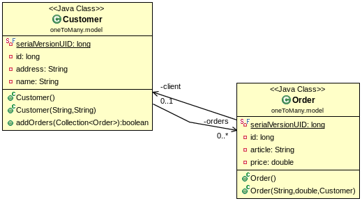

# Many to one

## Set up a new hibernate project
- create a new empty gradle project as for springboot
- create an application.properties file in the src/main/resources folder

```
spring.jpa.hibernate.ddl-auto=create
spring.datasource.url=jdbc:mysql://localhost:3306/db_example?useSSL\=false
spring.datasource.username=root
spring.datasource.password=simplonco
spring.datasource.driver-class-name=com.mysql.jdbc.Driver
```

## A many ton one situation



## Model

```java
package oneToMany.model;

import java.io.Serializable;
import java.util.Collection;
import java.util.HashSet;
import java.util.Set;

import javax.persistence.Column;
import javax.persistence.Entity;
import javax.persistence.GeneratedValue;
import javax.persistence.GenerationType;
import javax.persistence.Id;
import javax.persistence.OneToMany;
import javax.persistence.Table;
import javax.validation.constraints.Size;

@Entity
@Table(name = "Customers")
public class Customer implements Serializable {

	// default serial
	private static final long serialVersionUID = 1L;

	@Id
	@GeneratedValue(strategy = GenerationType.AUTO)
	@Column(name = "Customer_ID")
	private long id;

	@Size(max = 255)
	@Column(name = "Address")
	private String address;

	@Size(max = 65)
	@Column(name = "Name")
	private String name;

	@OneToMany(mappedBy="client")
	private Set<Order> orders = new HashSet<Order>();

	public Customer() {
		// TODO Auto-generated constructor stub
	}

	public Customer(@Size(max = 255) String address, @Size(max = 65) String name) {
		this.address = address;
		this.name = name;
		this.orders = new HashSet<Order>();
	}

	public boolean addOrders(Collection<Order> newOrders) {
		return this.orders.addAll(newOrders);
	}

}
```

et

```java
package oneToMany.model;

import java.io.Serializable;

import javax.persistence.Column;
import javax.persistence.Entity;
import javax.persistence.GeneratedValue;
import javax.persistence.GenerationType;
import javax.persistence.Id;
import javax.persistence.JoinColumn;
import javax.persistence.ManyToOne;
import javax.persistence.Table;
import javax.validation.constraints.Size;

@Entity
@Table(name = "Orders")
public class Order implements Serializable {

	// default serial
	private static final long serialVersionUID = 1L;

	@Id
	@GeneratedValue(strategy = GenerationType.AUTO)
	@Column(name = "Order_ID")
	private long id;

	@Size(max = 65)
	@Column(name = "Article")
	private String article;

	@Column(name = "Price")
	private double price;

	@ManyToOne
	@JoinColumn(name="Customer_ID")
	private Customer client;

	public Order() {
		// TODO Auto-generated constructor stub
	}

	public Order(@Size(max = 65) String article, double price, Customer client) {
		this.article = article;
		this.price = price;
		this.client = client;
	}

}

```

## Repository et Application

A faire   
