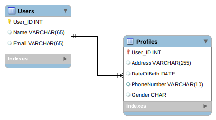

# Projets d'introduction hibernate

## One to one

Une relation one to one entre deux tables :

[one-to-one.md](1-one-to-one.md)

## Many to one

Une relation many to one entre deux tables :

[many-to-one.md](2-many-to-one.md)

## Application

Une application à coder plus vite que la pensée :
[application.md](3-application.md)

#### [retour](README.md)
