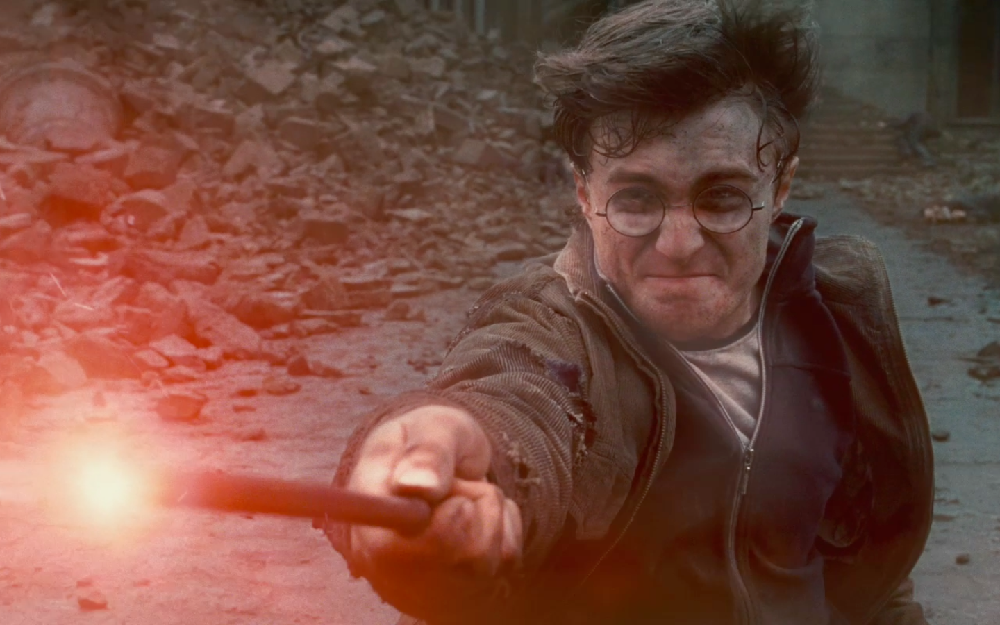

# Hibernate, encore plus de magie



## Documentation
[The java geek](http://www.thejavageek.com/jpa-tutorials/)

[Java code geeks](https://www.javacodegeeks.com/2015/02/jpa-tutorial.html#entitymanager)

[Un cours en français](http://orm.bdpedia.fr/introjpa.html)

[reference : API jpa d'oracle](https://docs.oracle.com/javaee/7/api/javax/persistence/package-summary.html)

[reference : tutorial jpa d'oracle](https://docs.oracle.com/javaee/7/tutorial/partpersist.htm)

## Rôle d’un système ORM

> Le rôle d’un système ORM est de convertir automatiquement, à la demande, la base de données sous forme d’un graphe d’objet. L’ORM s’appuie pour cela sur une configuration associant les classes du modèle fonctionnel et le schéma de la base de donnés. L’ORM génère des requêtes SQL qui permettent de matérialiser ce graphe ou une partie de ce graphe en fonction des besoins.

Pour bien comprendre cette notion de graphe et en quoi elle diffère de la représentation dans la base relationnelle, voici une petit échantillon de cette dernière.

**Table des films**

id	| titre      |	année  |idRéalisateur
-----|-----------|---------|----------------
17	|Pulp Fiction| 1994    |	37
54	|Le Parrain	 | 1972	   | 64
57	|Jackie Brown	| 1997	| 37

**Table des artistes**

id	|nom|	prénom	|année_naissance
---|----|---------|------------------
1	|Coppola	| Sofia	|1971
37|	Tarantino |	Quentin|	1963
64|	Coppola	 | Francis|	1939

Ce petit exemple illustre bien comment on représente une association en relationnel. C’est un mécanisme de référence par valeur (et pas par adresse), où la clé primaire d’une entité (ligne) dans une table est utilisée comme attribut (dit clé étrangère) d’une autre entité (ligne).

Ici, le réalisateur d’un film est un artiste dans la table Artiste, identifié par une clé nommée id. Pour faire référence à cet artiste dans la table Film, on ajoute un attribut clé étrangère idRealisateur dont la valeur est l’identifiant de l’artiste. Notez dans l’exemple ci-dessus que cet identifiant est 37 pour Pulp Fiction et Jackie Brown, 64 pour Le parrain, avec la correspondance à une et une seule ligne dans la table Artiste.

Voyons maintenant la représentation équivalente dans un langage objet en général (et donc java en particulier). Nous avons des objets, et la capacité à référencer un objet depuis un autre objet (cette fois par un système d’adressage). Par exemple, en supposant que nous avons une classe Artiste et une classe Film en java, le fait qu’un film ait un réalisateur se représente par une référence à un objet Artiste sous forme d’une propriété de la classe Film.

```java
class Film {

  (...)

  Artiste realisateur;

  (...)
}
```

Et du côté de la classe Artiste, nous pouvons représenter les films réalisés par un artiste par un ensemble.

```java
class Artiste {

  (...)

  Set<Film> filmsDiriges;

  (...)
}
```

> **Important** : On peut noter dès maintenant qu’une différence importante entre les associations en relationnel et en java est que les premières sont bi-directionnelles. Il est toujours possible par une requête SQL (une jointure) de trouver les films réalisés par un artiste, ou le réalisateur d’un film. En java, le lien peut être représenté de chaque côté de l’association, ou des deux. Par exemple, on pourrait mettre la propriété réalisateur dans la classe Film, mais pas filmsDiriges dans la classe Artiste, ou l’inverse, ou les deux. Cette subtilité est la source de quelques options plus ou moins obscures dans les systèmes ORM, nous y reviendrons.


## Mise en pratique   


[Des exos](td.md)   


#### [retour](https://jtobelem-simplon.github.io/training/README.md)
