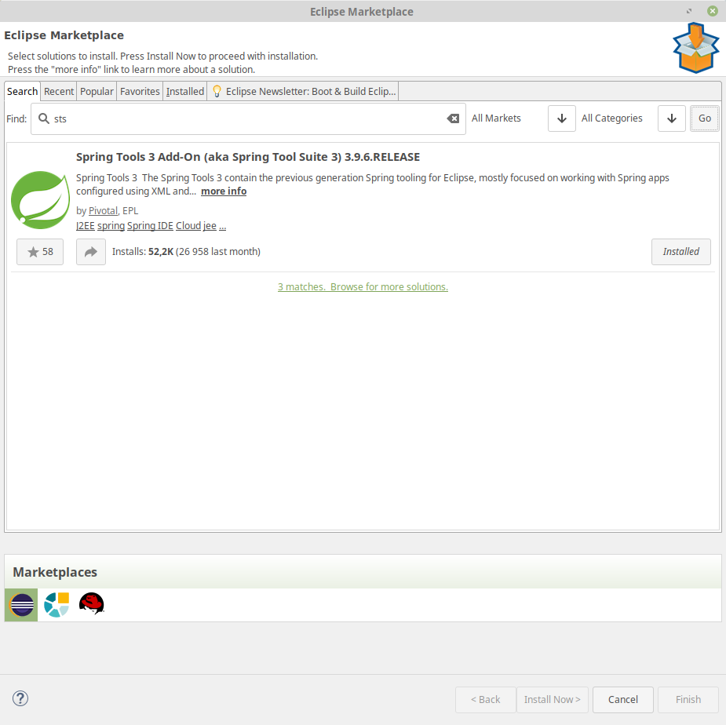

# Hello World!

#### Installation du plugin STS pour eclipse

A installer dans le marketplace :



#### Create a springboot project from scratch

- Start a new gradle project (remove all useless)
- Add ```spring-boot-starter-web``` to the build.gradle dependencies (go to [https://mvnrepository.com/](https://mvnrepository.com/))
- In a package co.simplon.hello, add the entry class :

```java
package co.simplon.hello;

import org.springframework.boot.SpringApplication;
import org.springframework.boot.autoconfigure.SpringBootApplication;

@SpringBootApplication
public class HelloApplication {

	public static void main(String[] args) {
		SpringApplication.run(HelloApplication.class, args);
	}
}
```

> Le @SpringBootApplication a trois fonctions :
- montrer que nous sommes en spring context
- scanner les fichiers qui se trouvent dans le même package que l'application
- permet l'autoconfiguration

- Create the controller class :

```java
package co.simplon.hello;

import org.springframework.stereotype.Controller;
import org.springframework.web.bind.annotation.RequestMapping;
import org.springframework.web.bind.annotation.ResponseBody;

@Controller
public class HelloController {

	@RequestMapping("/hello")
	@ResponseBody
	public String hello()
	{
		return "Hello World!";
	}
}
```

> Dans le monde Spring, le mot 'Controller' designe la classe qui fournit les services web (équivalent des Servlet en Java Web).
Pour définir un 'Controller' au sens Spring, on va ajouter à la classe précédemment créée l'annotations **@Controller**.
Grâce à cette annotation, Spring identifiera cette classe comme une classe 'spéciale' sur laquelle il travaillera.

> Pour relier la méthode hello() à une URI, on va ajouter à la déclaration de la méthode l'annotation **@RequestMapping**(chemin). (chemin étant la chaîne de caractère qui sera ajoutée à la fin de l'URL).
Comme notre méthode retourne un variable (ici une chaîne de caractères), il faut aussi ajouter l'annotation **@ResponseBody**.

#### Launch it

- Right click on HelloApplication, run as java application

```
.   ____          _            __ _ _
/\\ / ___'_ __ _ _(_)_ __  __ _ \ \ \ \
( ( )\___ | '_ | '_| | '_ \/ _` | \ \ \ \
\\/  ___)| |_)| | | | | || (_| |  ) ) ) )
'  |____| .__|_| |_|_| |_\__, | / / / /
=========|_|==============|___/=/_/_/_/
:: Spring Boot ::        (v2.1.0.RELEASE)

2018-11-23 16:39:56.175  INFO 20747 --- [           main] co.simplon.hello.HelloApplication        : Starting HelloApplication on SIMFOR084 with PID 20747 (/home/lab/Dropbox/simplon/Programmation/java/eclipse-workspace/springboot-hello/bin started by lab in /home/lab/Dropbox/simplon/Programmation/java/eclipse-workspace/springboot-hello)
2018-11-23 16:39:56.185  INFO 20747 --- [           main] co.simplon.hello.HelloApplication        : No active profile set, falling back to default profiles: default
2018-11-23 16:39:57.702  INFO 20747 --- [           main] o.s.b.w.embedded.tomcat.TomcatWebServer  : Tomcat initialized with port(s): 8080 (http)
2018-11-23 16:39:57.742  INFO 20747 --- [           main] o.apache.catalina.core.StandardService   : Starting service [Tomcat]
2018-11-23 16:39:57.742  INFO 20747 --- [           main] org.apache.catalina.core.StandardEngine  : Starting Servlet Engine: Apache Tomcat/9.0.12
2018-11-23 16:39:57.760  INFO 20747 --- [           main] o.a.catalina.core.AprLifecycleListener   : The APR based Apache Tomcat Native library which allows optimal performance in production environments was not found on the java.library.path: [/usr/java/packages/lib/amd64:/usr/lib64:/lib64:/lib:/usr/lib]
2018-11-23 16:39:57.906  INFO 20747 --- [           main] o.a.c.c.C.[Tomcat].[localhost].[/]       : Initializing Spring embedded WebApplicationContext
2018-11-23 16:39:57.907  INFO 20747 --- [           main] o.s.web.context.ContextLoader            : Root WebApplicationContext: initialization completed in 1649 ms
2018-11-23 16:39:57.951  INFO 20747 --- [           main] o.s.b.w.servlet.ServletRegistrationBean  : Servlet dispatcherServlet mapped to [/]
2018-11-23 16:39:57.958  INFO 20747 --- [           main] o.s.b.w.servlet.FilterRegistrationBean   : Mapping filter: 'characterEncodingFilter' to: [/*]
2018-11-23 16:39:57.958  INFO 20747 --- [           main] o.s.b.w.servlet.FilterRegistrationBean   : Mapping filter: 'hiddenHttpMethodFilter' to: [/*]
2018-11-23 16:39:57.958  INFO 20747 --- [           main] o.s.b.w.servlet.FilterRegistrationBean   : Mapping filter: 'formContentFilter' to: [/*]
2018-11-23 16:39:57.959  INFO 20747 --- [           main] o.s.b.w.servlet.FilterRegistrationBean   : Mapping filter: 'requestContextFilter' to: [/*]
2018-11-23 16:39:58.251  INFO 20747 --- [           main] o.s.s.concurrent.ThreadPoolTaskExecutor  : Initializing ExecutorService 'applicationTaskExecutor'
2018-11-23 16:39:58.491  INFO 20747 --- [           main] o.s.b.w.embedded.tomcat.TomcatWebServer  : Tomcat started on port(s): 8080 (http) with context path ''
2018-11-23 16:39:58.496  INFO 20747 --- [           main] co.simplon.hello.HelloApplication        : Started HelloApplication in 2.744 seconds (JVM running for 3.252)
```

- The service is now waiting for clients. Go to your web brother :   

#### [http://localhost:8080/hello](http://localhost:8080/hello)

#### Conclusion
Avec ce projet d'introduction, vous avez pu découvrir que :

- SpringBoot accélère la mise en place d'un projet
- SpringBoot utilise Maven (ou Gradle) pour gérer les dépendances du projet
- SpringBoot nécessite peu de configuration
- Cette configuration se fait dans les classes java à l'aide d'annotations (dont beaucoup restent à découvrir)
- SpringBoot fournit une encapsulation forte de serveur d'application (avec une configuration par défaut)
- SpringBoot c'est cool

#### [retour](../README.md)
