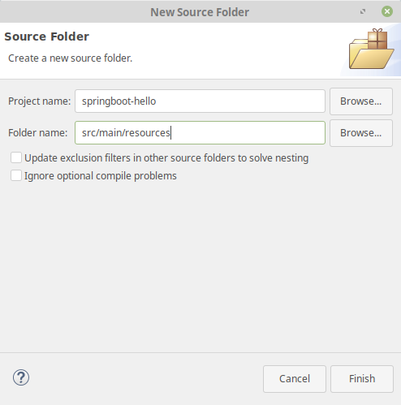
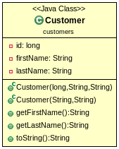

# Configure jdbc using spring-boot : easy

#### Initialization

- Start a new gradle project (remove all useless)
- add dependencies : spring-boot-starter-web (2.1), spring-boot-starter-jdbc (2.1) and mysql-connector-java (5.1.47)
- add a source folder /src/main/resources :



- and a file application.properties into that folder :

```
spring.jpa.hibernate.ddl-auto=create
spring.datasource.url=jdbc:mysql://localhost:3306/db_example?useSSL\=false
spring.datasource.username=root
spring.datasource.password=
spring.datasource.driver-class-name=com.mysql.jdbc.Driver
  ```

#### Database

Create an empty shema named db_example in your mysql database. Check your password in application.properties.

#### Model

- Create a simple class Customer :



#### Application

- Create a class Application :

```java
package customers;

import java.text.MessageFormat;
import java.util.Arrays;
import java.util.List;

import org.slf4j.Logger;
import org.slf4j.LoggerFactory;
import org.springframework.beans.factory.annotation.Autowired;
import org.springframework.boot.CommandLineRunner;
import org.springframework.boot.SpringApplication;
import org.springframework.boot.autoconfigure.SpringBootApplication;
import org.springframework.jdbc.core.JdbcTemplate;

@SpringBootApplication
public class Application implements CommandLineRunner {

    private static final Logger log = LoggerFactory.getLogger(Application.class);

    public static void main(String args[]) {
        SpringApplication.run(Application.class, args);
    }

    @Autowired
    JdbcTemplate jdbcTemplate;

    @Override
    public void run(String... strings) throws Exception {
    	createTable();
    	insertValues();

    	List<Customer> customers= findBySurname("Josh");
    	for (Customer customer : customers) {
    		log.info(customer.toString());
    	}

    }

    public void insertValues() {
      // TODO create and insert customers
    }

    public void createTable() {
    	 log.info("Creating tables");

         jdbcTemplate.execute("DROP TABLE IF EXISTS customers");
         jdbcTemplate.execute("CREATE TABLE customers(" +
                 "id SERIAL, first_name VARCHAR(255), last_name VARCHAR(255))");
    }
    /**
     * @param newCusto : the Customer to be added in database
     */
    public void insertCustomer(Customer newCusto) {
    	jdbcTemplate.update(
    			"INSERT INTO customers(first_name, last_name) VALUES (?,?)",
    			newCusto.getFirstName(),
    			newCusto.getLastName()
    			);
    }

}
```

- in a the method insertValues(), create the customers : "John Woo","Jeff Dean","Josh Bloch and "Josh Long". Use the insertCustomer method to add them in database.

#### Mapping
- Create a class CustomerRowMapper :

```java
package customers;

import java.sql.ResultSet;
import java.sql.SQLException;

import org.springframework.jdbc.core.RowMapper;

public class CustomerRowMapper implements RowMapper<Customer>{

	@Override
	public Customer mapRow(ResultSet rs, int rowNum) throws SQLException {
		return new Customer(rs.getLong("id"), rs.getString("first_name"), rs.getString("last_name"));
	}


}
```

- use it in a method findBySurname. This method is to be placed in the Application class :

```java
public List<Customer> findBySurname(String surname){
    	 log.info(MessageFormat.format("Querying for customer records where first_name = {0}:", surname));

         return jdbcTemplate.query(
                 "SELECT id, first_name, last_name FROM customers WHERE first_name = ?", new Object[] {surname },
                 new CustomerRowMapper());
    }
```

- test this method in the main method to print out all Customer whose surname is "Josh"


#### [retour](td.md)
