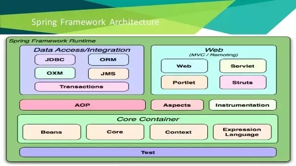

# SpringBoot

## Introduction

#### a) Spring Vs Spring MVC Vs Spring boot
> **Spring framework**. Most important feature of Spring Framework is Dependency Injection. At
the core of all Spring Modules is Dependency Injection or IOC Inversion of
Control. An other role is to work with other frameworks : hibernate, junit & mockito

> **Spring MVC Framework** provides decoupled way of developing web
applications. With simple concepts like Dispatcher Servlet, ModelAndView
and View Resolver, it makes it easy to develop web applications.

> **Spring boot framework** makes the configuration of spring easy. Also provides monitoring tools.

Pour simplifier cette configuration, Spring Boot propose 2 fonctionnalités principales que nous allons voir dans la suite de ce chapitre :

- l'auto-configuration,
- les starters.

[Aller plus loin sur openclass room](https://openclassrooms.com/fr/courses/4668056-construisez-des-microservices/5122425-decouvrez-le-framework-spring-boot)

#### b) Les 7 choses que doivent savoir un débutant

[http://www.springboottutorial.com/introduction-to-spring-boot-for-beginners](http://www.springboottutorial.com/introduction-to-spring-boot-for-beginners)

#### c) 10 raisons de se mettre à Spring

[Partie 1](http://blog.ellixo.com/2015/06/08/10-raisons-de-se-mettre-a-Spring-Boot-1ere-partie.html)

[Partie 2](http://blog.ellixo.com/2015/06/26/10-raisons-de-se-mettre-a-Spring-Boot-2eme-partie.html)

## Documentation

#### a) Les guides

[https://spring.io/guides](https://spring.io/guides)

#### b) Documentation de référence

[https://docs.spring.io/spring-boot/docs/2.1.0.RELEASE/reference/htmlsingle/](https://docs.spring.io/spring-boot/docs/2.1.0.RELEASE/reference/htmlsingle/)   

## Mise en pratique   

Trois applications à reproduire et une à faire entièrement :
[applications](td.md)   

#### [retour](../../README.md)
