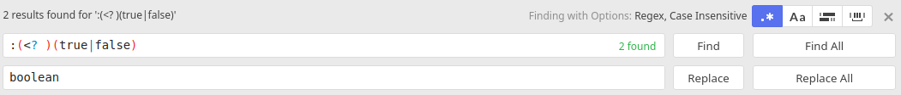

# Requête sur api rest et conversion du résultat en objets java

## Requete

Voici une requête pour obtenir les users github qui ont plus de 100 followers
https://api.github.com/search/users?q=followers>100

## Analyser la structure du json

La requête dans un navigateur fournit ce résultat. On garde le premier objet de la liste et on ferme les accolades/crochets.

```
{
  "total_count": 5,
  "incomplete_results": false,
  "items": [
    {
      "login": "100rabhkr",
      "id": 11437004,
      "node_id": "MDQ6VXNlcjExNDM3MDA0",
      "avatar_url": "https://avatars1.githubusercontent.com/u/11437004?v=4",
      "gravatar_id": "",
      "url": "https://api.github.com/users/100rabhkr",
      "html_url": "https://github.com/100rabhkr",
      "followers_url": "https://api.github.com/users/100rabhkr/followers",
      "following_url": "https://api.github.com/users/100rabhkr/following{/other_user}",
      "gists_url": "https://api.github.com/users/100rabhkr/gists{/gist_id}",
      "starred_url": "https://api.github.com/users/100rabhkr/starred{/owner}{/repo}",
      "subscriptions_url": "https://api.github.com/users/100rabhkr/subscriptions",
      "organizations_url": "https://api.github.com/users/100rabhkr/orgs",
      "repos_url": "https://api.github.com/users/100rabhkr/repos",
      "events_url": "https://api.github.com/users/100rabhkr/events{/privacy}",
      "received_events_url": "https://api.github.com/users/100rabhkr/received_events",
      "type": "User",
      "site_admin": false,
      "score": 62.338333
    }
    ]
  }
  ```

  Ensuite on  replace en utilisant les regexp (par exemple avec atom) :
  - `: "[^"]*"` par string
  - `: (<? )[-0-9]+` par number (ou mieux par int ou double)
  - `:(<? )(true|false)` par boolean

Avec atom :


On obtient au final :
```
{
  "total_count": int,
  "incomplete_results": boolean,
  "items": [
    {
      "login": string,
      "id": int,
      "node_id": string,
      "avatar_url": string,
      "gravatar_id": string,
      "url": string,
      "html_url": string,
      "followers_url": string,
      "following_url": string,
      "gists_url": string,
      "starred_url": string,
      "subscriptions_url": string,
      "organizations_url": string,
      "repos_url": string,
      "events_url": string,
      "received_events_url": string,
      "type": string,
      "site_admin": boolean,
      "score": double
    }
    ]
  }
  ```
