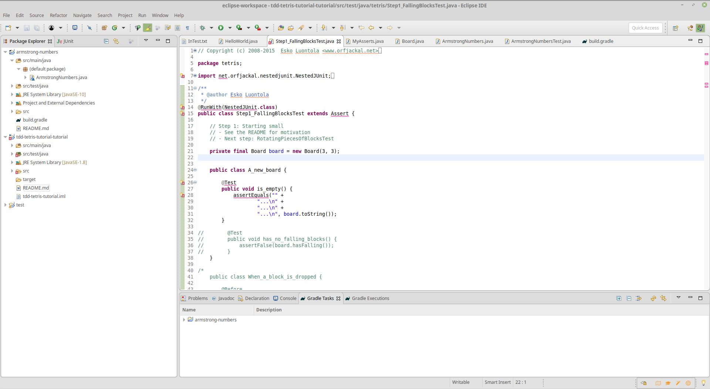

## Qu'est qu'un IDE?

[Wikipedia : environnement de developpement](https://fr.wikipedia.org/wiki/Environnement_de_d%C3%A9veloppement)

*En programmation informatique, un environnement de développement est un ensemble d'outils qui permet d'augmenter la productivité des programmeurs qui développent des logiciels. Il comporte un éditeur de texte destiné à la programmation, des fonctions qui permettent, par pression sur un bouton, de démarrer le compilateur ou l'éditeur de liens ainsi qu'un débogueur en ligne, qui permet d'exécuter ligne par ligne le programme en cours de construction. Certains environnements sont dédiés à un langage de programmation en particulier.*

---

## Eclipse

- compilateur
- débogueur
- coloration et complétion du code
- outils d'édition avancée
- intégration d'outils de developpement (git, maven, junit, ...)
- ... bien d'autres choses

> Un IDE est un outil complexe à maîtriser, mais permet rapidement de gagner en productivité

---

## D'autres IDE

- Intellij
- Visualcode
- Atom

#### [retour](../../README.md)
