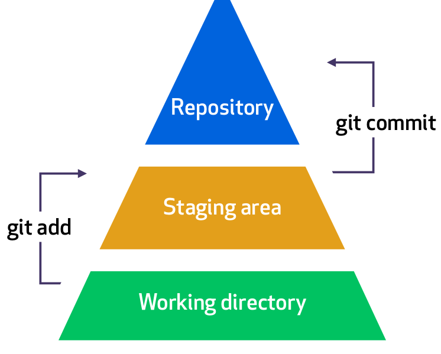
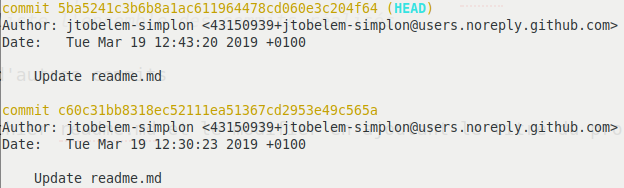
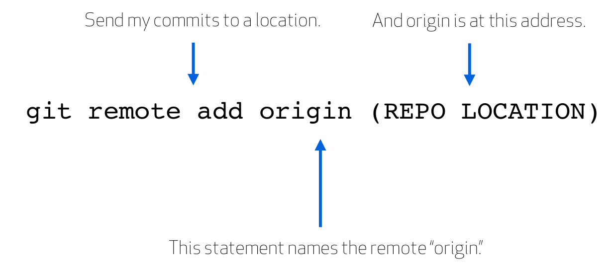
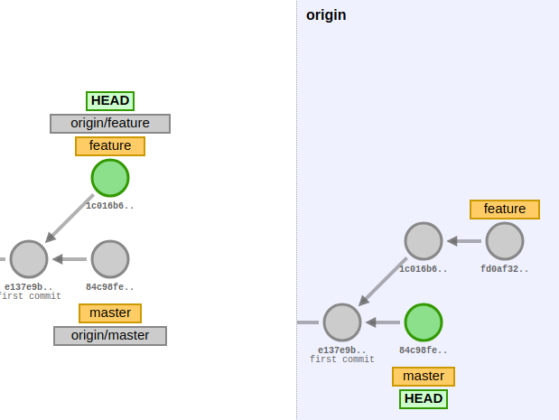

# Git, github

## Généralités

Une bonne introduction des commandes de base, des généralités sur git et github :
[https://guides.github.com/introduction/git-handbook/](https://guides.github.com/introduction/git-handbook/)

Git est le logiciel de versionning le plus utilisé par les developpeurs. L'autre grand nom est svn : [stackoverflow -> why is git better than subversion](https://stackoverflow.com/questions/871/why-is-git-better-than-subversion).

## Quelques cas d'utilisation en ligne de commande et avec visualizing-git

#### Exercice 1 : commandes de base en local

  1) Créer un repository (en local)

```bash
cd desktop
git init demo
cd demo
ls -al
```

*remarque : `ls -al` est la commande linux pour lister le contenu du répertoire. Pour windows, on peut utiliser `dir`*

> `git init` va créer un répertoire nommé demo. Ce répertoire contient un répertoire caché nommé .git et qui contiendra l'historique local des versions.

2) Créer un fichier



```bash
touch readme.md
git status
git add readme.md
git status
git commit -m 'ajoute le fichier readme'
git log
```
> Créer le fichier avec la commande linux touch, cela ne modifie rien au git status, il faut utiliser git add.
> `git status` indique l'ensemble des différences avec HEAD
> `git log` liste l'ensemble des commits réalisés

3) Réaliser d'autres commits

Ouvrir le fichier readme.md et le modifier en ajoutant le titre du projet, puis sauver.

```bash
git status
git add readme.md
git status
git commit -m 'ajout du titre du projet'
git status
```
> Il faut ajouter les fichiers impactés à chaque modification avant de commiter.
> Chaque commit devrait être unitaire et impacter un changement précis.

Ou encore
```bash
git commit -a -m 'ajout du titre du projet'
```

> L'option -a permet d'ajouter au stage tous les fichiers qui ont déjà été ajoutés précédemment et qui ont été modifiés ou supprimés, mais pas les fichiers qui n'ont jamais été ajoutés.


4) Revenir à un état antérieur

Dans le git log, regarder les 4 premiers caractères du commit auquel vous souhaitez accéder.



Entrer la commande suivante :

```bash
git reset --hard c60c
```

> Cette commande va effacer toutes les modifications faites après le commit dont le numéro commence par c60c.   
> Plus de détail ici : [stackoverflow -> how to revert a git repository to a previous commit]( https://stackoverflow.com/questions/4114095/how-to-revert-a-git-repository-to-a-previous-commit)   

#### Exercice 2 : placer un repo sur github

Nous allons partir du repo local précédent et souhaitons que les commits soient enregistrés sur une machine distante. Celle-ci sera vue comme un `remote`.

1) Créer un repo sur github du même nom que celui de l'exercice 1


2) On va ajouter dans notre repo local une référence au repo distant. On l'appelera origin.



```bash
git remote add origin (repo location)
git remote -v
tree .git/refs
```
> L'emplacement du repo est qqch comme : `https://github.com/jtobelem/demo.git`.
> On peut consulter la liste des remote associés à notre repo avec -v.

```bash
tree .git/refs
```
> Sous linux, on peut visualiser les remote avec la commande tree

3) Pusher une première modification sur le repo distant

```bash
git push -u origin master
```
> -u est un raccourci pour --set-upstream, donc les prochaines fois, on pourra juste faire git push

4) Modifier le readme sur l'interface distante (donc sur github). Récupérer les modifications distantes non encore présente en local.

```bash
git fetch
git diff master origin/master
git merge
```

> La commande **git diff** permet de comparer la branche locale master avec la branche master du remote origin   
> **fetch** permet récupérer les modifications distantes. On peut ensuite les intégrer avec la commande merge.
> fetch + merge = pull

5) Modifier à nouveau le readme sur l'interface distante en ajoutant 'remote' sur la dernière ligne ET en local en ajoutant 'local' sur la dernière ligne. Tentez un pull.. Réglez les conflits.

```bash
git config --global core.editor "atom --wait"
```

> C'est assez pratique de configurer un editeur à utiliser avec git en cas de conflit. On peut le faire avec la commande précédente.
> Plus de détails sur la résolution de conflits : [stackoverflow -> how to resolve merge conflicts](https://stackoverflow.com/questions/161813/how-to-resolve-merge-conflicts-in-git/163659#163659)

#### Exercice 3 : branches (avec visualizing)

Les branches sont des pointeurs sur des commits.

1) Utiliser [https://git-school.github.io/visualizing-git/](https://git-school.github.io/visualizing-git/) pour réaliser plusieurs commits successifs


2) Créer une nouvelle branche :

```bash
git branch feature
git checkout feature
```
> `git branch` pour créer la branche et checkout pour la selectionner. On peut directement faire `git checkout -b` feature.

3) Réaliser de nouveaux commits dans cette branche. Et pendant qu'on devloppe cette nouvelle feature, le master continue d'évoluer. Selectionner master et faire quelques commit dedans.

4) Réaliser des essais avec la catégorie upstream changes.



## Github flow

Le workflow standard sur GitHub, cad la séquence d'actions à réaliser pour modifier un projet :   
[https://guides.github.com/introduction/flow/](https://guides.github.com/introduction/flow/)

## Documenter vos projets

Documenter votre projet avec markdown :   
[https://guides.github.com/features/mastering-markdown/](https://guides.github.com/features/mastering-markdown/)

Quelles informations placer dans un readme, comment le structurer. Mettre en place un wiki  :   
[https://guides.github.com/features/wikis/](https://guides.github.com/features/wikis/)

Une fonctionnalité super-nice! pour transformer un repo en site html   
[https://guides.github.com/features/pages/](https://guides.github.com/features/pages/)

## Kahoot time
Ne pas cliquer! (lien de présentation)      
https://play.kahoot.it/#/?quizId=a2d4bc5a-8def-4fd0-89be-c51c10ada340

#### [retour](../README.md)
