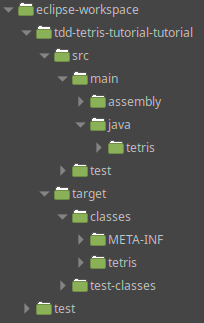

## Maven

La compilation produit un .class pour chaque .java.

Seuls les .class sont nécessaires au déploiement d'une appli, il faut les séparer des .java pour livrer, donc avoir une arborescence parallèle.

On peut utiliser Maven pour configurer la façon dont les dossiers sont organisés.

Tout est indiqué dans le fichier : [pom.xml](./pom.xml)

Les buts (goals en anglais) principaux du cycle de vie d'un projet Maven sont:

- compile
- test
- package
- install
- deploy

## Gradle

Comme Maven.

On peut importer directement dans Eclipse des projets Maven, Gradle, ...

Lorsque les dépendances sont présentes sur le site : [https://mvnrepository.com/](https://mvnrepository.com/), elles peuvent être téléchargées automatiquement au build.

#### [retour](../../README.md)
