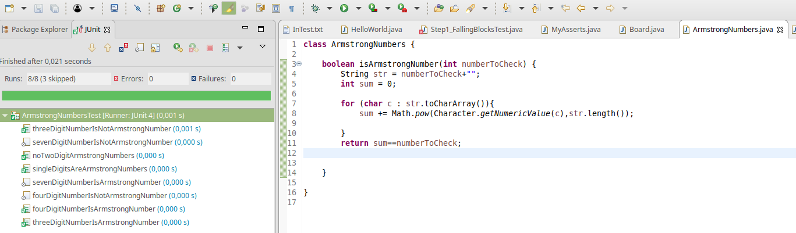

# Junit : Unit testing et TDD

## Unit testing

L'idée est de tester des morceaux très précis du code. Pour cela, il va falloir isoler les actions faites par chaque méthode. Notre code sera donc bien découpé (pas de méthode trop longue), et le but de chaque méthode est clair et précis.

## TDD, test driven developpement.

C'est une méthode de conception de programme qui consiste à écrire les tests avant d'écrire le programme. L'idée est que sachant bien ce que l'on veut obtenir (la validation du test), on peut écrire plus facilement le programme, on sait où l'on va.

Le cycle préconisé par TDD comporte cinq étapes (voir aussi [wikipedia](https://fr.wikipedia.org/wiki/Test_driven_development)) :

1. écrire un premier test ;
2. vérifier qu'il échoue (car le code qu'il teste n'existe pas), afin de vérifier que le test est valide ;
3. écrire juste le code suffisant pour passer le test ;
4. vérifier que le test passe ;
5. puis réusiner le code, c'est-à-dire l'améliorer tout en gardant les mêmes fonctionnalités.

## Junit

Junit est un framework permettant de réaliser des tests unitaires en java.

Il est intégré à Eclipse, lorsque la barre est verte, tout va bien :

## Pour aller plus loin
[Tutoriel sur junit](https://github.com/in28minutes/getting-started-in-5-steps/tree/master/junit-in-5-steps)

#### [retour](../../README.md)
