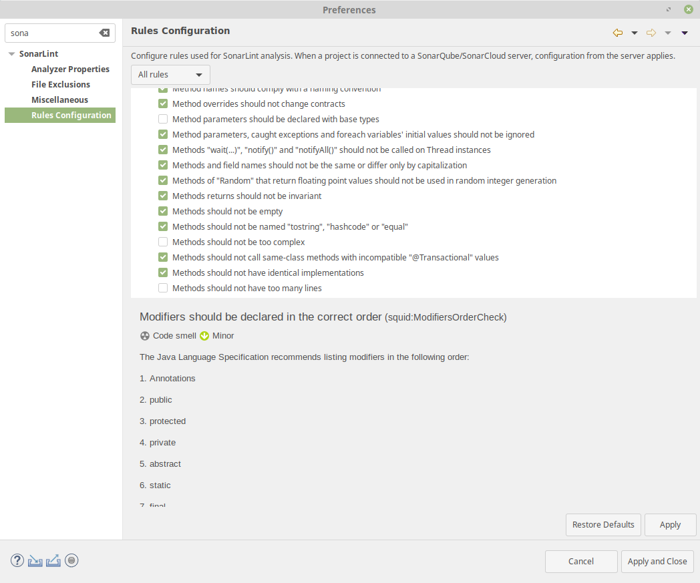
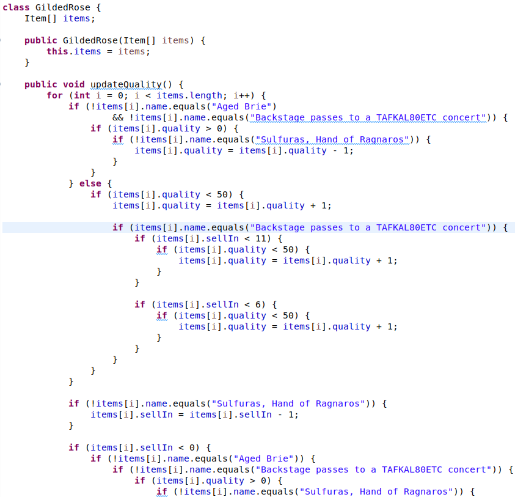

# Tester votre application web

Tests unitaires. Couverture du code. Code linter.

## A. Vérification rapide

On peut vérifier séparément que toutes les parties de notre application fonctionnent correctement. Une première approche consiste à faire des diagnostiques en regardant directement chaque partie pour voir si elle a *"l'air fonctionnelle"*.

#### Contrôler la BD (ide ou script)
- on peut regarder le contenu de la bd directement avec un ide (workbench, datagrip, phpmyadmin, ...)
- ou bien lancer un script qui affiche le contenu de toutes les tables

> On contrôle que les données stockées sont valides

#### Contrôler le frontend

- on écrit un scénario de test qui couvre toutes les toutes les fonctionnalités
- on vérifie que les retours sont ceux attendus et que la console ne comporte pas d'erreur

#### Contrôler l'interface du backend (postman)

- tester toutes les url publiées par le contrôleur

## B. Mise en place de tests unitaires systématiques

Une meilleure pratique est d'implémenter au fur et à mesure des tests unitaires (une encore meilleure pratique est de coder en tdd, les tests d'abord). On vérifie à chaque nouveau développement qu'il n'y a pas eu de régression. Ces tests doivent couvrir l'intégralité du code.

> Problème : comment savoir lorsqu'un test sur le contrôleur échoue, si ce n'est pas lié à la connexion à  la bd?

#### Tester le backend (junit)

- [ ] tester les [endpoints](controller.md) de l'application (donc le contrôleur)
- [ ] tester les méthodes des services
- [ ] tester les repository
- [ ] tester que l'application démarre
- [ ] tester l'application dans son ensemble (les deniers points ensembles)

Un repository pour s'entraîner : [https://github.com/jtobelem-simplon/java-workshop-spring-test.git](https://github.com/jtobelem-simplon/java-workshop-spring-test.git)

#### Tester le frontend (prochaine session)

Il existe aussi un mécanisme de tests unitaires avec Angular, à voir une prochaine fois :[https://angular.io/guide/testing](https://angular.io/guide/testing)

## C. Réduction du nombre de bugs grâce à l’hygiène : code linter

Une bonne approche, complémentaire de la B. est d'utiliser un code linter. C'est un ensemble de règles (sur le nommage des variables, la longueur des méthodes, redondance, etc...) qui va vous permettre de limiter le nombre de bugs grâce à un code propre.

On peut utiliser Sonar Lint pour eclipse. Il définit un ensemble de règles (que l'on peut sectionner ou non) :

Les éléments du code qui ne vérifient pas les règles vont apparaître soulignés avec une vague bleue dans l'éditeur :

