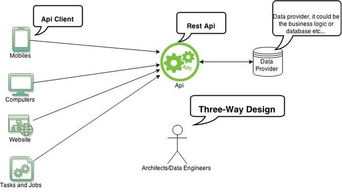

# What is a REST service?

#### First an application server : tomcat, glassfish, webdev, ...

   

Au centre, notre serveur d'application attend les requêtes des clients.    
Il leur donne une réponse au format json.

#### Zoom into the service

   

Le serveur d'application va devoir analyser les requêtes, ensuite les traiter, puis transformer la réponse pour la renvoyer au format http.


# A book service using spring

- Start a new gradle project (remove all useless)
- Add ```spring-boot-starter-web``` to the build.gradle dependencies (go to [https://mvnrepository.com/](https://mvnrepository.com/))
- Create a package co.simplon.book. Create the class :

```java
package co.simplon.book;

import org.springframework.boot.SpringApplication;
import org.springframework.boot.autoconfigure.SpringBootApplication;

@SpringBootApplication
public class BookApplication {

	public static void main(String[] args) {
		SpringApplication.run(BookApplication.class, args);
	}
}
```

- Now, create the object model (only 3 attributes, getters, setters and constructor & toString using fields) :   


- Finally create a class :

```java
package co.simplon.book;

import java.util.Arrays;
import java.util.List;

import org.springframework.web.bind.annotation.GetMapping;
import org.springframework.web.bind.annotation.RestController;

@RestController
public class BookController {

	@GetMapping("/books")
	public List<Book> findAll(){
		return Arrays.asList(new Book(1l, "Thinking in java", "Bruce Eckel"));
	}
}

```

> Cette classe implémente une méthode findAll qui retourne une liste contenant un seul livre codé en dur (on aurait pu aller chercher dans une BDD).
> Le GetMapping va associer la méthode findAll au endpoint /books


> Spring Boot looks at a) Frameworks available on the CLASSPATH b) Existing
configuration for the application. Based on these, Spring Boot provides
basic configuration needed to configure the application with these
frameworks. This is called Auto Configuration .

#### Launch it

- Right click on BookApplication, run as java application
- The service is now waiting for clients. Go to your web brother :

#### [http://localhost:8080/books](http://localhost:8080/books)

#### Conclusion

- It's easy to deploy a rest api
- You can now send data in the structured json format

#### [retour](../README.md)
