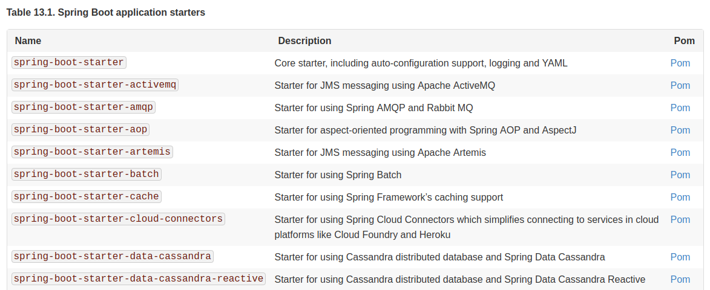

## Documentation

#### Deux projets laposte
hello world : https://github.com/simplonco/java-springboot-decouverte

actors (jdbc+js):
https://github.com/simplonco/java-springboot-actor

#### Documentation de référence :
[https://docs.spring.io/spring-boot/docs/2.1.0.RELEASE/reference/htmlsingle/](https://docs.spring.io/spring-boot/docs/2.1.0.RELEASE/reference/htmlsingle/)

#### Les guides
https://spring.io/guides

#### Les starters

#### Les 7 choses que doivent savoir un debutant
http://www.springboottutorial.com/introduction-to-spring-boot-for-beginners

#### 10 raisons de se mettre à spring
http://blog.ellixo.com/2015/06/08/10-raisons-de-se-mettre-a-Spring-Boot-1ere-partie.html

http://blog.ellixo.com/2015/06/26/10-raisons-de-se-mettre-a-Spring-Boot-2eme-partie.html

#### 20 projets utilisant spring boot
http://www.springboottutorial.com/spring-boot-projects-with-code-examples

#### Spring Vs Spring MVC Vs Spring boot
> **Spring framework**. Most important feature of Spring Framework is Dependency Injection. At
the core of all Spring Modules is Dependency Injection or IOC Inversion of
Control. An other role is to work with other frameworks : hibernate, junit & mockito

> **Spring MVC Framework** provides decoupled way of developing web
applications. With simple concepts like Dispatcher Servlet, ModelAndView
and View Resolver, it makes it easy to develop web applications.

> **Spring boot framework** makes the configuration of spring easy. Also provides monitoring tools.

## Installation
#### Eclipselink : https://www.eclipse.org/eclipselink/
-> dans quel but?

#### Hibernate : http://hibernate.org/orm/releases/5.3/
-> pourquoi l'installer?

#### Plugin eclipse :
- (jboss, à tester) https://stackoverflow.com/questions/351640/how-to-install-hibernate-tools-in-eclipse
- (STS, ok) https://github.com/simplonco/java-springboot-decouverte

## Tuto
#### hibernate tuto github :
https://github.com/callicoder/jpa-hibernate-tutorials
- one to one
- one to many
- many to many

https://github.com/in28minutes/SpringBootForBeginners
base de donnée h2
