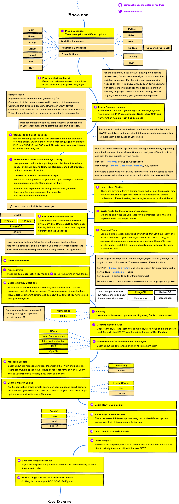

# Developpement Web

Une application web peut-être découpée en 2 parties : front, qui représente l'interface utilisateur qui va être visualisée sur un navigateur chez le client et back, qui représente le cœur de l'application avec une partie base de donnée et l'utilisation d'un langage objet.

Les images qui suivent viennent de ce repo : [https://github.com/kamranahmedse/developer-roadmap.git]

## 1. Frontend

### [Maquetter son application](front/mockup/README.md)

Réaliser une maquette de son application avant de la coder, afin de préciser les cas d'utilisation et de guider l'implémentation.

### [html/css](front/html/README.md)

La base.

### [angular](front/angular/README.md)

Un framework pour le front qui utilise type script, une surcouche de js.

## 2. Backend

### [Langage java](../java/README.md)

Un langage solide et parmi les plus utilisés.

### [Base de données](../bd/README.md)

## 3. Sécurité

Vérifier que l'application ne possède pas de faille de sécurité connue, à différents niveaux.

## 4. Tests

### [Posman](tests/postman/README.md)

Valider que le serveur réagit bien comme il le doit en observant ses réponses et en lui envoyant des messages sans passer par le front.

#### [retour](../README.md)
